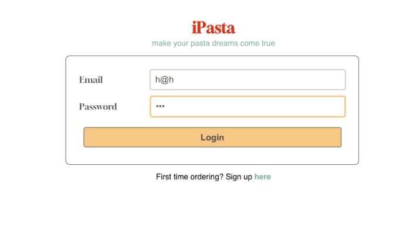
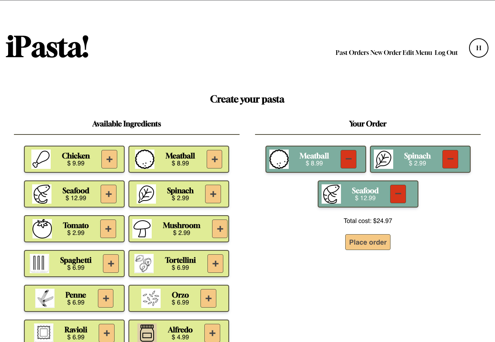
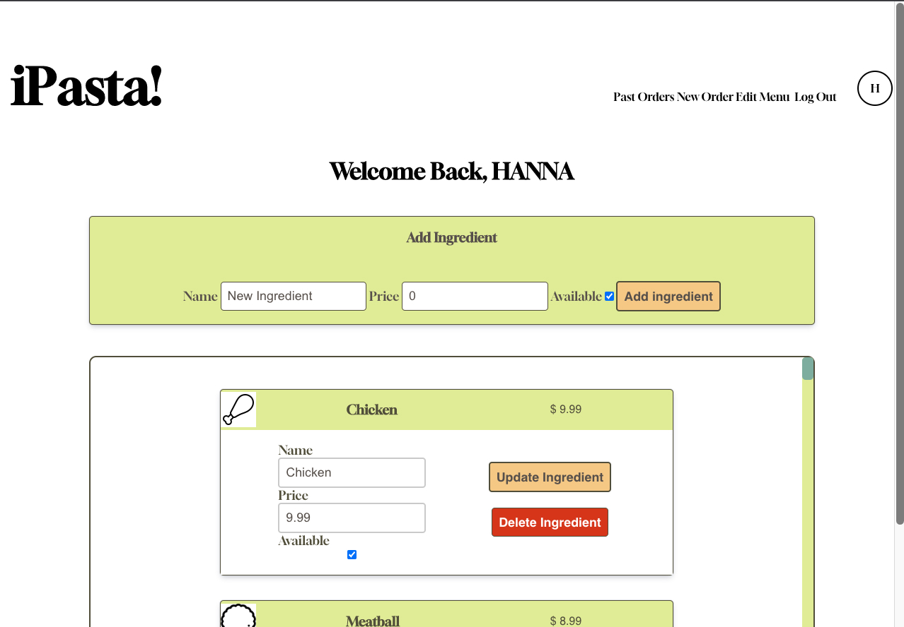
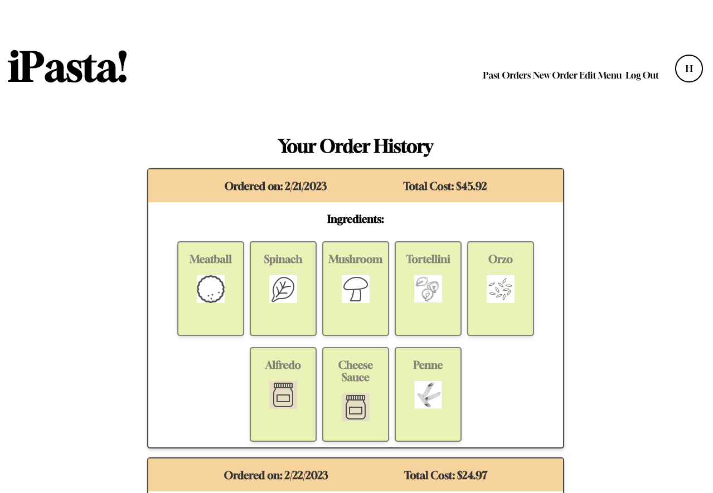

# iPasta!
Build-your-own restaurants have been on the rise, but we have yet to see one to build your own pasta dish. For the pasta lovers, customize your own bowl of pasta!

<figure>
    <figcaption>Login</figcaption>
    
</figure>
<figure>
    <figcaption>Build your own pasta bowl</figcaption>
    
</figure>
<figure>
    <figcaption>Edit menu page upon login as an admin</figcaption>
    
</figure>
<figure>
    <figcaption>Order History</figcaption>
    
</figure>

## Technologies used
- JavaScript
- HTML/CSS
- MongoDB, Express, React, and Node

## Getting Started
- [iPasta](https://ipasta.onrender.com/)
- [Project planning](https://trello.com/invite/b/u6XD04Yr/ATTIa6f6a65e5e14502596b753d09759abec7BC08F30/pasta-bar)
- [Pitck deck](https://docs.google.com/presentation/d/1rPvgnreUqrph27inIy1vy3vsMNEOonbVnSwRqAZDFOg/edit?usp=sharing)

## Next Steps
### Version 2
- AAU, I want to be able to save my order history
- AAU, I would like to order multiple meals per order
- AAU, I would like to specify ingredient amount( light, normal, extra).
### Version 3
- AAU, I would like a discount for trying a mystery pasta.

### For the Development Team
- Fork and Clone this repo
- `cd pasta-bar`
- checkout a new branch
- `npm i`
- `touch .env` (Andrew will send development db connection info)
- `npm run build`
- `npm start`, `nodemon server`