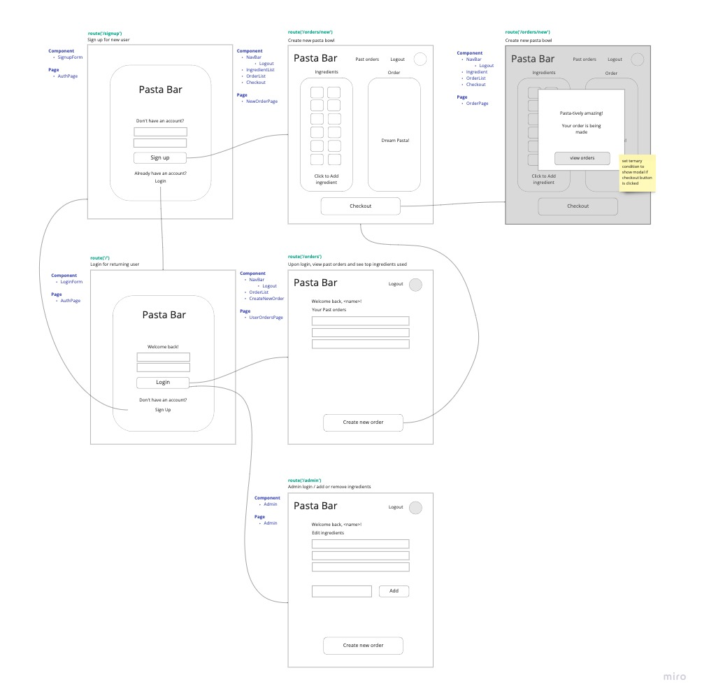
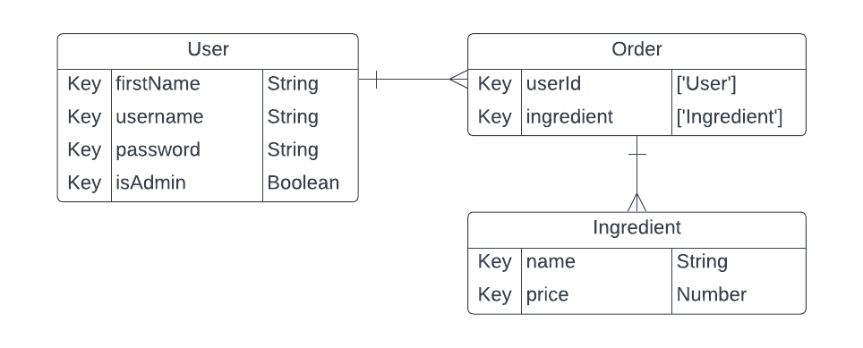

### For the Development Team
- Fork and Clone this repo
- cd pasta-bar
- checkout a new branch
- npm i
- touch .env (Andrew will send development db connection info)
- npm run build
- npm start, nodemon server

# iPasta!
Build-your-own restaurants have been on the rise, but we have yet to see one to build your own pasta dish. For the pasta lovers, customize your own bowl of pasta!

## Roles
- Katherine | SCRUM master
- Andrew | GitHub manager
- Konstantin | Database manager
- Mitchell | Designer/Documenter
- Hanna | Designer/Documenter

## Technologies used
- JavaScript
- CSS
- MERN

## Getting Started
- [Project planning](https://trello.com/invite/b/u6XD04Yr/ATTIa6f6a65e5e14502596b753d09759abec7BC08F30/pasta-bar)
- [Pitck deck](https://docs.google.com/presentation/d/1rPvgnreUqrph27inIy1vy3vsMNEOonbVnSwRqAZDFOg/edit?usp=sharing)

### Wireframes
<figure>
    <figcaption></figcaption>
    
</figure>

### ERD
<figure>
    <figcaption></figcaption>
    
</figure>

## Next Steps
### Version 2
- AAU, I want to be able to save my order history
- AAU, I would like to order multiple meals per order
- AAU, I would like to specify ingredient amount( light, normal, extra).
### Version 3
- AAU, I would like a discount for trying a mystery pasta.